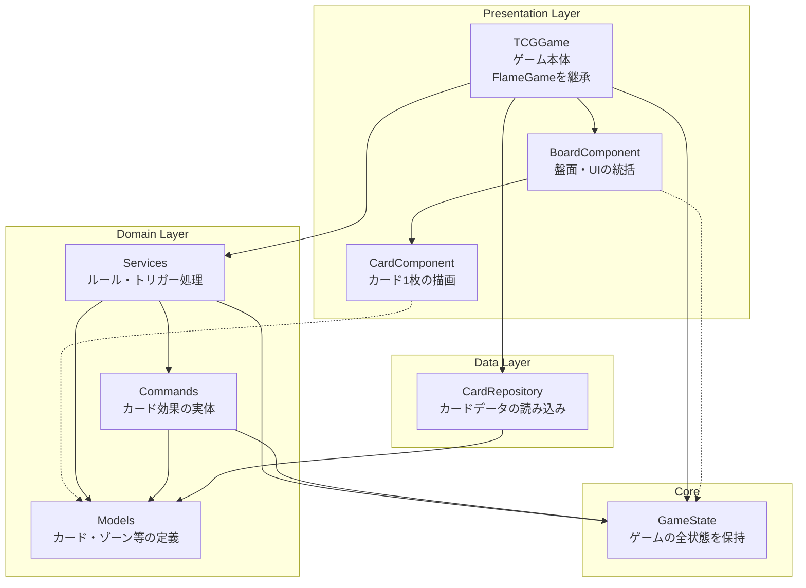
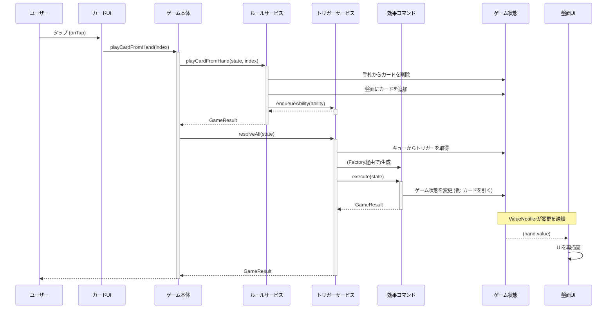
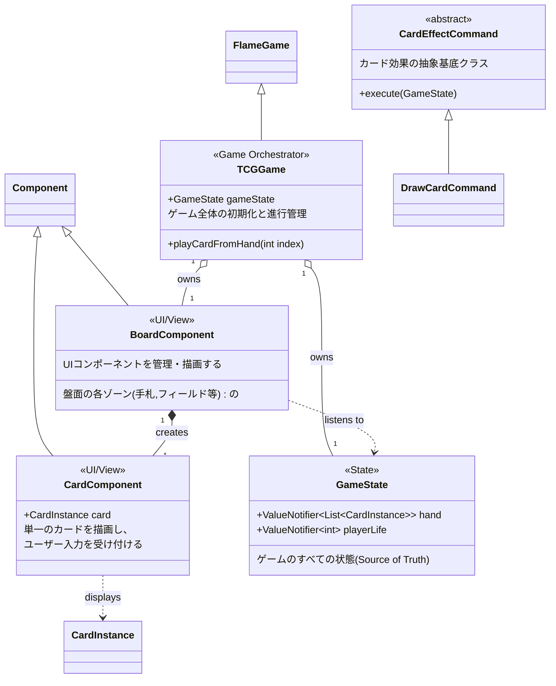

# 2Dカードゲーム アーキテクチャ方針書 (v1.3)

## 1. 概要と目的

このドキュメントは、Flutter/Flameで開発する2Dカードゲームのソフトウェアアーキテクチャに関する基本方針を定めるものです。

本プロジェクトの目的は、保守性・拡張性・テスト容易性の高いコードベースを維持し、複雑化するカード効果のロジックを効率的に管理することです。生成AIによるコーディング支援を最大限活用しつつも、アーキテクチャの一貫性を保ち、技術的負債の発生を防ぎます。

## 2. 基本アーキテクチャ

**Flameのコンポーネントベースアーキテクチャ (FCS)** を全面的に採用します。
ゲーム内に存在するすべてのオブジェクト（カード、プレイヤー、盤面、UI要素など）は、原則として `Component` またはその集合体として表現します。

これにより、機能の追加・変更をコンポーネントの着脱で実現し、オブジェクト間の結合度を低く保ちます。

## 3. レイヤー構造とディレクトリ構成

コードベースを以下の3つの主要なレイヤーに分割し、関心事を分離します。

| レイヤー | 役割 | 担当技術/クラス |
| --- | --- | --- |
| **Presentation** | 見た目とユーザー入力の受付 | Flame `Component`, Flutter `Widget` |
| **Domain** | ゲームのルール、ビジネスロジック | 純粋なDartクラス (ロジック、状態管理) |
| **Data** | データの永続化、外部サービスとの連携 | Repositoryパターンを実装したDartクラス |

これを実現するため、`lib/` 配下を以下のディレクトリ構成とします。

```
lib/
├── core/                 # アプリケーション全体で共有されるコア機能
│   └── game_state.dart   # ゲーム全体の共有状態 (リアクティブ)
│
├── data/
│   └── repositories/     # データソースとの通信を担うRepository
│       └── card_repository.dart
│
├── domain/
│   ├── models/           # ゲーム内の論理的なオブジェクト(Card, GameZoneなど)
│   ├── services/         # 複数の状態をまたがるロジック(FieldRule, TriggerService)
│   └── commands/         # カード効果などをオブジェクト化したコマンド
│       ├── card_effect_command.dart
│       └── (各種コマンド).dart
│
└── presentation/
    ├── components/       # FlameのUIコンポーネント (BoardComponent, CardComponent)
    └── game/             # FlameGameの本体 (TCGGame)
```

## 4. Component設計原則

Presentationレイヤーの `Component` をクリーンに保つため、以下の原則に従います。

*   **単一責任の原則 (SRP):** 1つの`Component`は1つの責務のみを持ちます。
    *   **例:** `CardComponent`はカードの見た目（描画）と入力受付に専念します。カードの「効果」ロジックは持ちません。
*   **状態と見た目の分離:**
    *   `Component`は原則として状態を持ちません。状態はすべて`GameState`に集約します。
    *   `Component`は`GameState`内の状態を**購読**し、その変更に応じて自身の見た目を更新します。
*   **リアクティブなUI更新:**
    *   `update`メソッド内で毎フレーム状態を監視する（ポーリング）のは非効率なため禁止します。
    *   代わりに、`GameState`が公開する`ValueNotifier`を購読し、変更があった場合にのみUIを更新するリアクティブなアプローチを採用します。（詳細は「6. 状態管理方針」を参照）

## 5. 複雑なカードロジックの設計パターン

カードゲームの核心である「高度なロジック」を管理するため、以下のパターンを導入します。

### 5.1. コマンドパターン (Command Pattern)

カードの効果は、メソッドではなく **「効果コマンドオブジェクト」** として表現します。

*   `domain/commands/` 配下に、基底クラス `CardEffectCommand` を定義します。
*   具体的な効果（例: 「カードを1枚引く」）は、`DrawCardCommand` のように具象クラスとして実装します。

```dart
// domain/commands/card_effect_command.dart
abstract class CardEffectCommand {
  GameResult execute(GameState gameState);
}

// domain/commands/draw_card_command.dart
class DrawCardCommand extends CardEffectCommand {
  final int count;
  DrawCardCommand({required this.count});

  @override
  GameResult execute(GameState gameState) {
    // デッキからカードを引くロジック...
  }
}
```

### 5.2. コマンドファクトリ (Command Factory)

YAML定義ファイル内の効果データ (`EffectStep`) から、具体的なコマンドオブジェクトを生成するため、**ファクトリ**を導入します。

*   `OperationExecutor`（または`CommandFactory`）クラスがこの責務を担います。
*   `op`文字列（例: `'draw'`）をキーとして、対応するコマンドオブジェクト（例: `DrawCardCommand`）を生成して返します。

```dart
// domain/commands/command_factory.dart (将来の実装例)
class CommandFactory {
  static CardEffectCommand? fromEffectStep(EffectStep step) {
    switch (step.op) {
      case 'draw':
        final count = step.params['count'] as int? ?? 1;
        return DrawCardCommand(count: count);
      // 他のコマンド...
      default:
        return null;
    }
  }
}
```

### 5.3. イベントバス (Event Bus)

ある効果が、ゲーム内の不特定多数のオブジェクトに影響を与える場合（例: 「全ユニットの攻撃力を+1する」）、イベントバスを利用してコンポーネント間の疎結合を保ちます。

*   `FlameGame`クラスがイベントバス（`StreamController`など）を保持します。
*   効果を発動した側は、`UnitSummonedEvent` のようなイベントを発行するだけです。
*   各`Component`は、自身が関心のあるイベントを購読し、対応する処理を実行します。

## 6. 状態管理方針

*   **唯一の情報源 (Single Source of Truth):**
    *   ゲームに関わるすべての状態（ターン、ライフ、手札、盤面など）は、`core/game_state.dart` に定義された `GameState` クラスで**一元管理**します。
*   **リアクティブな状態公開:**
    *   `GameState`は、UIの更新が必要なプロパティを `ValueNotifier` として公開します。これにより、UIコンポーネントは状態の変更をリアクティブに検知できます。

```dart
// core/game_state.dart (実装例)
class GameState {
  // 手札の状態。変更がUIに通知される。
  final ValueNotifier<List<CardInstance>> hand = ValueNotifier([]);

  // ライフの状態
  final ValueNotifier<int> playerLife = ValueNotifier(8000);

  // 状態を変更するメソッド
  void addCardToHand(CardInstance card) {
    final currentHand = List<CardInstance>.from(hand.value);
    currentHand.add(card);
    hand.value = currentHand; // valueを更新するとリスナーに通知が飛ぶ
  }
}
```

*   **UIコンポーネントでの購読:**
    *   `Component`側では、`ValueNotifier`をリッスンし、変更があった時のみ自身の再描画や更新処理を行います。これにより、`update`メソッドでの毎フレームチェックが不要になります。

## 7\. インフラ (Firebase) との連携

**原則: FlameのComponentは、Firebaseのサービスを直接importしたり、呼び出したりしてはならない。**

*   Firebaseとの通信は、`data/repositories/` に配置された **Repositoryクラスに完全に隔離**します。
*   Repositoryの呼び出しは、`FlameGame`クラスが責任を持って行います。
    *   **読み込み:** ゲーム開始時 (`onLoad`) やロード画面中に行う。
    *   **書き込み:** ターン終了時やゲーム終了時など、**ゲームループの更新タイミングとは非同期**の特定のイベントをトリガーとして行う。

この方針により、ゲームロジックをインフラから切り離し、テスト容易性を確保し、ネットワーク遅延がゲームのパフォーマンスに影響を与えるのを防ぎます。

## 8. Appendix: アーキテクチャ図

### 8.1. コンポーネント図

システムの主要なレイヤーコンポーネントと、それらの依存関係を示します。



### 8.2. シーケンス図（「手札からカードをプレイする」場合）

ユーザーが手札のカードをタップしてから、効果が解決されUIが更新されるまでの一連の流れを示します。



### 8.3. クラス図

主要なクラス間の静的な関係性（継承、集約、依存）を示します。

